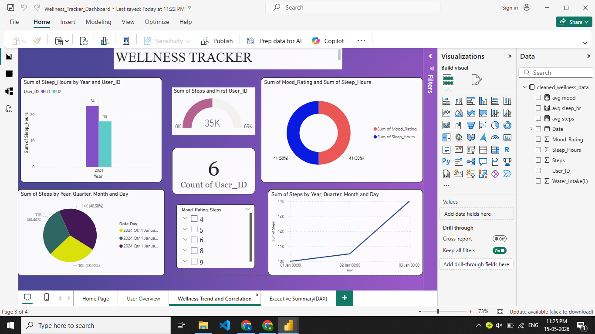

# Wellness Tracker Dashboard

## Project Overview  
A Power BI dashboard developed to monitor and analyze daily wellness activities including steps, sleep duration, water intake, and mood levels for better health awareness.

## Objective
To transform raw wellness data into actionable insights that help users understand and improve their daily lifestyle habits.

 ## Tools Used
- Microsoft Power BI
- DAX Measures
- CSV Dataset

## Key Features
- Real-time KPI Cards
- User Wellness Summary
- Sleep vs Mood Correlation Analysis
- Water Intake Monitoring
- Dynamic Filters & Slicers

## Dashboard Screens

## Major Findings
- Better sleep patterns are linked with improved mood scores
- Consistent water intake supports healthier lifestyle habits
- Step count trends help track physical activity progress
- Interactive visuals make wellness analysis easier

  ## Key Insights
- Higher sleep hours are associated with better mood ratings
- Adequate water intake contributes to improved wellness
- Daily step tracking helps monitor overall fitness trends
- Interactive dashboards help identify healthy and unhealthy patterns

